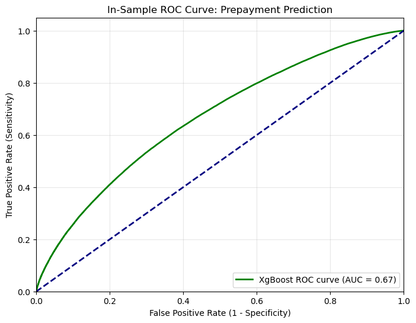
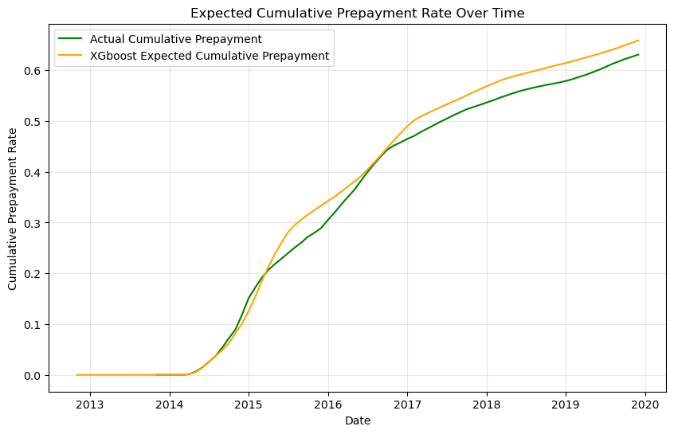
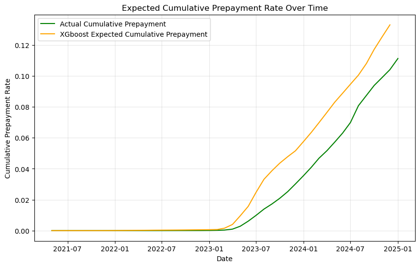

# Predicting Mortgage Prepayment

With new Federal Reserve Board members onboarding, the US is likely entering a period of a dove-ish approach to monetary policy and lower interest rates. Declining mortgage rates will likely lead to an increase in rate-refinances for mortgages. Predicting mortgage refinance rates will have important implications for the multi-trillion MBS market. 

## Data
I calibrated the model with monthly single-family loan-level data originated during or slightly before 2014 Q1. I pick this period because it was one of the most recent vintages to experience several periods of declining mortgage interest rates. In addition, it offers the ability to examine several years of mortgage performance previous to the extraordinary economic environment during the COVID crisis. 
The model features both static variables known at origination and dynamic variables which change monthly. Table 1 shows the dynamic variables.
| Variable Name | Description |
|---|---|
| Refi Benefit Now | The magnitude of the financial benefit from refinancing, expressed as the Net Present Value (NPV) assuming the loan term stays the same and there are no transaction costs. I use the lowest mortgage interest rate in the last three months to calculate the NPV. |
| Refi Benefit Past | There is a phenomenon known as 'woodheaded borrowers' in mortgage finance (See Deng and Quigley, 2004). Such borrowers have not refinanced in the past when it would have been financially beneficial. When borrowers have missed opportunities in the past, they are more likely to do so in the future. This variable is NPV from refinancing in the period before the last three months, using the lowest interest rate observed since five months after origination. |
| HPI Growth | When the collateral appreciates in value, it becomes easier to refinance (See Mattey and Wallace, 2001). This variable measures the magnitude of home price appreciation for the area (MSA where available, otherwise state) using the FHFA home price index. |

Below are the static variables.

| Variable Name | Description |
|---|---|
| Loan Age | Months since loan origination |
| OLTV | Loan-to-value ratio at origination |
| CSCORE_MAX | The maximum of the borrower and, where applicable, co-borrower credit score |
| coop_condo_dummy | An indicator variable for whether the collateral is a coop or cooperative unit |
| SATO | Spread at time of origination, the difference between the average mortgage rate and the loan's contract rate. High SATOs often are a sign of borrowers who are relatively uneducated about mortgage markets, inattentive to financial decision-making, or have some other characteristic which makes them a less appealing borrower |
## Methodology

I use XGBoost, with a grid search to find optimal hyperparameters. 

## In-Sample Results

Below is the ROC curve for in-sample results. This measures the explanatory power of the model for a particular loan-month observation.

An alternative performance measure is how well the model predicts portfolio-level prepayment. Below is a comparison of the true and fitted cumulative prepayment rate for the entire sample. In order to predict prepayment, I create a data set with observations for each loan for each month of the sample, regardless of whether the loan actually prepays or not. 

Note that in order to focus on the prepayment fit, rather than the quality of interest rate and home price forecasts, this analysis assumes perfect foresight of interest rates and home price appreciation. In practice, one would need to use forecasted values and model performance would likely deteriorate.

## Out-of-Sample Results

I test the model out-of-sample performance with a recent sample of loans originated during or slightly before 2023Q1. I picked these loans there has been sufficient time for prepayment to occur. In addition, mortgage interest rates climbed from their historic COVID-crisis lows by that time, meaning this vintage is likely to exhibit some future rate-driven prepayment. 

Below are loan-level ROC curves and sample-level prepayment forecasts for this sample. 

## Future work

I plan on reducing repetition in the code by creating generic functions for tasks that appear in more than one program.

When I have access to computing power larger than my laptop, I will increase the estimation and validation samples. I all also look at the performance of the model by subsets, such as FICO/LTV buckets and different magnitude of the prepayment option values.

As a smaller refinement, I could interpolate home price appreciation rather than use the quarterly values for each month. 

## List of Programs in Order of Execution

load_clean_transform: Loads the raw loan-month level observations, cleans them and constructs the key variables for the estimation set.

make_pred_df: Makes data set with all potential loan-month observations. Used for in-sample cumulative prepayment prediction.

data_explore: Makes various descriptive statistics

estimate_models_no_weights:Estimates xgboost model with cross-validation.

test_data: Like load_clean_transform, but for the out-of-sample validation

make_pred_df_oos: Like make_pred_df, but for the out-of-sample validation

oos_validate_v2: Calculates ROC curves and actual and forecasted cumulative prepayment for the out-of-sample validation. 

estimate models: Estimates xgboost model with cross-validation and upweights the rare prepayment events. The weighted version grossly overestimates prepayment, and this version of the model is not used.